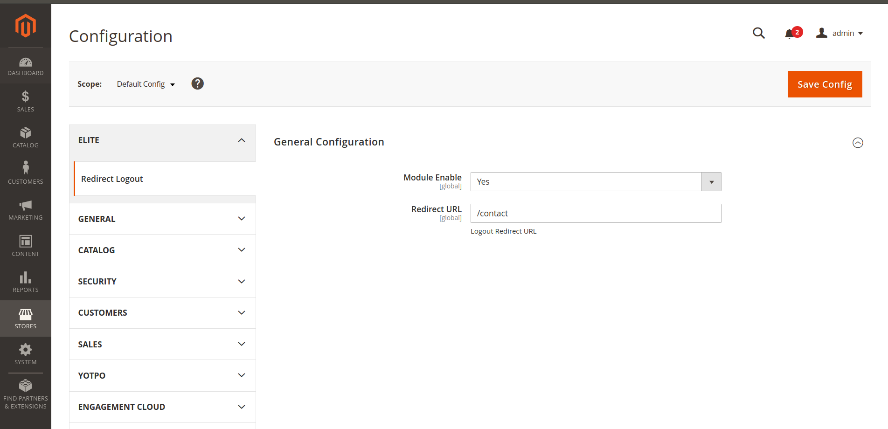

<h1>Magento 2 Custom Logout Redirect</h1>

Compatible with magento 2.3.*

<h2>Installtion</h2>
<ol>
	<li>Create Elite/RedirectLogout inside your app/code folder to your magento installtion</li>
	<li>git clone https://github.com/Emil1997/magento2-custom-logout-redirect.git inside /app/code/Elite/RedirectLogout folder</li>
	<li>php bin/magento module:enable Elite_RedirectLogout</li>
	<li>php bin/magento setup:upgrade</li>
	<li>php bin/magento setup:di:compile</li>
</ol>

<h2>Configuration</h2>
<ol>
    <li>Navigate to: Stores -> Configuration</li>
    <li></li>
    <li>Redirect URL: Set the path you want to redirect after logout</li>
</ol>

